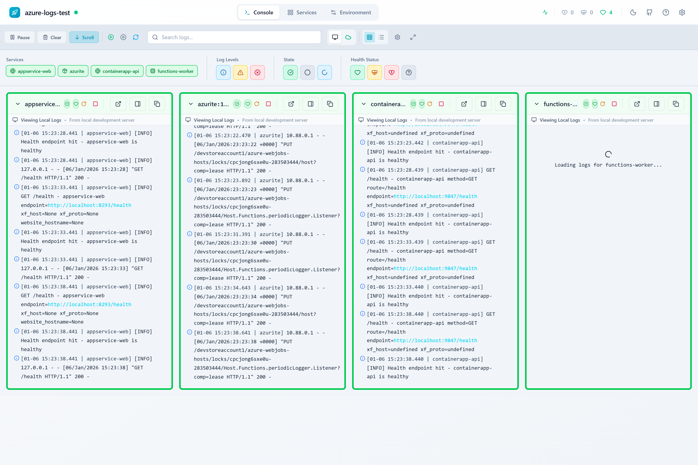
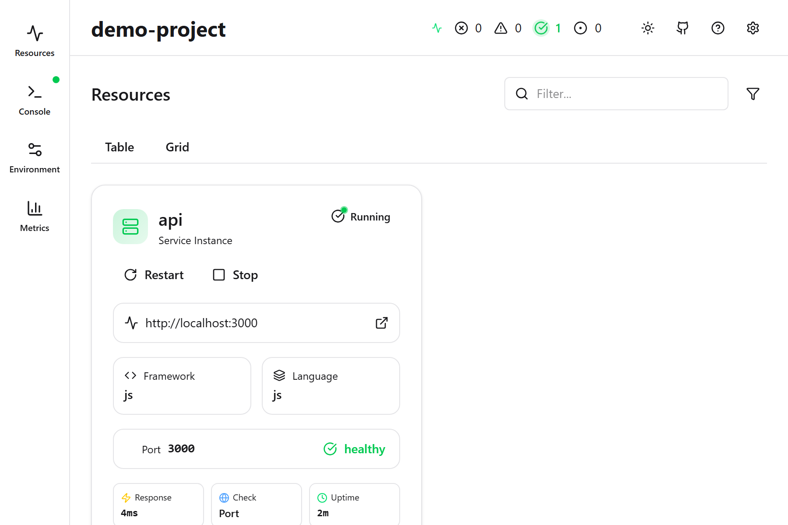

<div align="center">

# azd app

### **Run Azure Apps Locally**

One command starts all services, manages dependencies, and provides real-time monitoring.

[](https://github.com/jongio/azd-app/actions/workflows/ci.yml)
[](https://github.com/jongio/azd-app/actions/workflows/release.yml)
[](https://codecov.io/gh/jongio/azd-app)
[](https://goreportcard.com/report/github.com/jongio/azd-app/cli)
[](https://opensource.org/licenses/MIT)
[](https://github.com/jongio/azd-app/actions/workflows/codeql.yml)
[](https://pkg.go.dev/github.com/jongio/azd-app/cli)
[](https://github.com/jongio/azd-app/actions/workflows/govulncheck.yml)
[](https://github.com/jongio/azd-app/actions/workflows/ci.yml)
[](https://go.dev/)
[](https://github.com/jongio/azd-app)

<br />

[**🌐 Visit the Website →**](https://jongio.github.io/azd-app/)

*Interactive docs, guided tour, and live demos*

[**📦 Part of azd Extensions →**](https://jongio.github.io/azd-extensions/)

*Browse all Azure Developer CLI extensions by Jon Gallant*

<br />

---

</div>

## ⚡ One-Command Start

Stop juggling terminals. Run `azd app run` and watch everything come alive.

```bash
azd app run
```

That's it. All your services start with dependencies resolved automatically.

<div align="center">



*Real-time dashboard showing all your running services*

</div>

---

## ✨ Features

<table>
<tr>
<td width="50%">

### 📊 Real-time Dashboard
Monitor all your services in one place with live status updates and health checks. See what's running, what's failing, and where to click.



### 📝 Unified Logs
Stream and filter logs from all services—both local and Azure. Search, highlight, and export with ease. Switch between local and cloud logs with a single click.


</td>
<td width="50%">

### 🔧 Auto Dependencies
Automatically installs packages, creates virtual environments, and resolves requirements across Node.js, Python, .NET, and more.

### 🧪 Multi-Language Testing
Run tests across all services with `azd app test`. Supports Node.js, Python, and .NET with unified coverage reporting.

### 🤖 AI-Powered Debugging
Connect GitHub Copilot via MCP to analyze logs, diagnose issues, and suggest fixes. Your AI pair programmer that understands your running app.

### ❤️ Health Monitoring
Automatic health checks with visual indicators. Know when services need attention before your users do.

### 🚀 Zero Configuration
Works with your existing `azure.yaml`. No new config files, no complex setup. Just run and go.

</td>
</tr>
</table>

---

## 🎯 Quick Start

### 1. Install Azure Developer CLI

<details>
<summary><b>Windows</b></summary>

```powershell
winget install microsoft.azd
```
</details>

<details>
<summary><b>macOS</b></summary>

```bash
brew tap azure/azd && brew install azd
```
</details>

<details>
<summary><b>Linux</b></summary>

```bash
curl -fsSL https://aka.ms/install-azd.sh | bash
```
</details>

### 2. Install azd-app

```bash
# Add extension source
azd extension source add -n jongio -t url -l https://jongio.github.io/azd-extensions/registry.json

# Install the extension
azd extension install jongio.azd.app
```

### 3. Run Your App

```bash
cd your-azd-project
azd app run
```

<div align="center">

### 📚 Want the full walkthrough?

[**Start the Guided Tour →**](https://jongio.github.io/azd-app/tour/1-install/)

</div>

---

## 🤖 AI Integration with MCP

azd app includes a Model Context Protocol (MCP) server that connects your running application to AI assistants like GitHub Copilot.

**10 AI Tools Available:**
- **Observability**: `get_services`, `get_service_logs`, `get_project_info`
- **Operations**: `run_services`, `stop_services`, `restart_service`, `install_dependencies`
- **Configuration**: `check_requirements`, `get_environment_variables`, `set_environment_variable`

Ask Copilot things like:
- *"Why is my API returning 500 errors?"*
- *"Restart the web service and show me the logs"*
- *"What environment variables are set for the API?"*

[**Learn about MCP Integration →**](https://jongio.github.io/azd-app/mcp/)

---

## 📋 Supported Languages & Frameworks

| Language | Package Managers | Frameworks |
|----------|-----------------|------------|
| **Node.js** | npm, pnpm, yarn | Express, Next.js, React, Vue, Angular, Svelte, Astro, NestJS |
| **Python** | pip, uv, poetry | FastAPI, Flask, Django, Streamlit, Gradio |
| **.NET** | dotnet | ASP.NET Core, Aspire |
| **Java** | Maven, Gradle | Spring Boot, Quarkus |
| **Go** | go | - |
| **Rust** | cargo | - |
| **PHP** | composer | Laravel |
| **Docker** | docker | Docker Compose |

---

## 📊 By the Numbers

<div align="center">

| 10+ MCP Tools | <5 min Setup | 100% Open Source | Works with Copilot |
|:-------------:|:------------:|:----------------:|:------------------:|
| Full AI integration | Quick start | MIT License | GitHub Copilot ready |

</div>

---

## 📖 Documentation

<div align="center">

| | |
|:---:|:---:|
| [**🚀 Quick Start**](https://jongio.github.io/azd-app/quick-start/) | Get running in under 5 minutes |
| [**🎯 Guided Tour**](https://jongio.github.io/azd-app/tour/1-introduction/) | Step-by-step walkthrough |
| [**📚 CLI Reference**](https://jongio.github.io/azd-app/reference/cli/) | All commands documented |
| [**🤖 MCP Guide**](https://jongio.github.io/azd-app/mcp/) | AI integration setup |

</div>

---

## 🤝 Contributing

Contributions are welcome! See [CONTRIBUTING.md](./CONTRIBUTING.md) for guidelines.

---

## 🔗 azd Extensions

azd app is part of a suite of Azure Developer CLI extensions by [Jon Gallant](https://github.com/jongio).

| Extension | Description | Website |
|-----------|-------------|---------|
| **[azd app](https://github.com/jongio/azd-app)** | Run Azure apps locally with auto-dependencies, dashboard, and AI debugging | [jongio.github.io/azd-app](https://jongio.github.io/azd-app/) |
| **[azd copilot](https://github.com/jongio/azd-copilot)** | AI-powered Azure development with 16 agents and 28 skills | [jongio.github.io/azd-copilot](https://jongio.github.io/azd-copilot/) |
| **[azd exec](https://github.com/jongio/azd-exec)** | Execute scripts with azd environment context and Key Vault integration | [jongio.github.io/azd-exec](https://jongio.github.io/azd-exec/) |
| **[azd rest](https://github.com/jongio/azd-rest)** | Authenticated REST API calls with automatic scope detection | [jongio.github.io/azd-rest](https://jongio.github.io/azd-rest/) |

🌐 **Extension Hub**: [jongio.github.io/azd-extensions](https://jongio.github.io/azd-extensions/) — Browse all extensions, quick install, and registry info.

---

## 📄 License

MIT License - see [LICENSE](./LICENSE) for details.

---

<div align="center">

### Ready to get started?

[**🌐 Get Started at jongio.github.io/azd-app →**](https://jongio.github.io/azd-app/)

<br />

Built with ❤️ for Azure developers

</div>

